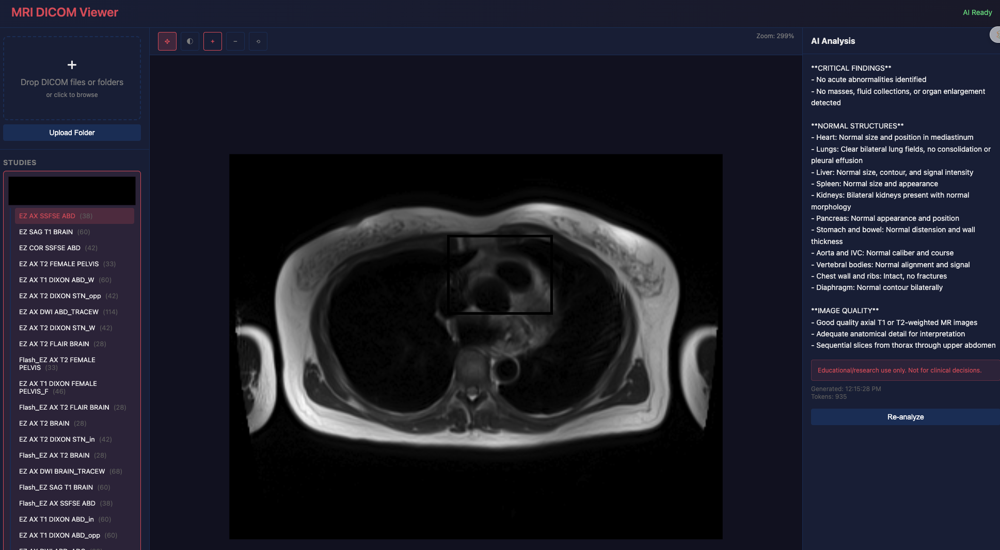

# DICOM AI Viewer

A web application for viewing medical DICOM images with AI-powered interpretation using Claude.



## Features

- **DICOM Viewer** - View MRI and other DICOM images with zoom, pan, and window/level controls
- **Folder Upload** - Upload entire patient folders with automatic organization by patient and body location
- **Slice Navigation** - Browse through image slices with slider or keyboard controls
- **AI Interpretation** - Automatic analysis using Claude API when opening a series
  - Critical findings highlighted first
  - Normal structures listed
  - Results cached to avoid redundant API calls

## Tech Stack

- **Frontend**: React + Vite
- **Backend**: Python FastAPI
- **DICOM Parsing**: pydicom
- **AI**: Anthropic Claude API

## Quick Start

### Backend

```bash
cd backend
python -m venv venv
source venv/bin/activate  # Windows: venv\Scripts\activate
pip install -r requirements.txt

# Set API key for AI features
export ANTHROPIC_API_KEY="your-api-key"

python main.py
```

### Frontend

```bash
cd frontend
npm install
npm run dev
```

Open http://localhost:5173

## Usage

1. Click "Upload Folder" or drag & drop DICOM files/folders
2. Select a study and series from the left sidebar
3. Use viewer controls to navigate slices and adjust image display
4. AI interpretation appears automatically in the right panel

## Keyboard Shortcuts

- `←` / `↑` - Previous slice
- `→` / `↓` - Next slice
- Mouse wheel - Zoom

## Disclaimer

This application is for **educational and research purposes only**. AI interpretations should NOT be used for clinical decision-making. Always consult qualified medical professionals for diagnosis and treatment.

## License

MIT
